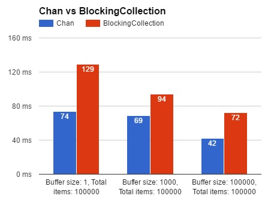

# Chan4Net
A simple C# implementation of Golang/Go `chan` (https://tour.golang.org/concurrency/2).

## Installation
NuGet package is avaiable via https://www.nuget.org/packages/Chan4Net.
```
Install-Package Chan4Net
```

## Performance
The automated performance tests are included in the test project. You can run on you machine.
`Chan4Net` beats `BlockingCollection` on my local as below.



## APIs

### Create a chan of a type.
```csharp
// A buffered chan
var bufferedChan = new Chan<int>(2); // Size must be >= 1 for a buffered channel.

// An unbuffered chan
var unbufferedChan = new Chan<int>();
```

### `Send()` item
```csharp
var chan = new Chan<int>(2);
chan.Send(1);
chan.Send(2);
chan.Send(3); // Will block the current thread because the channel is full
```

### `Receive()` item
```csharp
var chan = new Chan<int>(2);
chan.Send(1);
chan.Send(2);

var a = chan.Receive(); // a == 1
var b = chan.Receive(); // b == 2
var c = chan.Receive(); // Will block the current thread because the channel is empty.
```

### `Yield()` items
```csharp
var chan = new Chan<int>(2);
chan.Send(1);
chan.Send(2);

foreach(var item in chan.Yield()) {
    Console.WriteLine(item);  // Outputs 1, 2 and then block and wait, because the channel is empty.
}

Console.WriteLine("Will never come to this line");
```

### `Close()` channel
Sending item to a closed channel will throw exception.
```csharp
var chan = new Chan<int>(2);
chan.Send(1);
chan.Close();

chan.Send(2);  // Here throws InvalidOperationException, because one cannot send item into a closed channel.
```
Receiving item from a closed AND empty channel will throw exception.
```csharp
var chan = new Chan<int>(2);
chan.Send(1)
chan.Close();

var a = chan.Receive(); // a == 1
var b = chan.Receive(); // Here throws InvalidOperationException because no more item in the closed channel.
```

Calling `Close()` will release the blocking `Yield()`.
```csharp
var chan = new Chan<int>(2);
chan.Send(1);
chan.Send(2);
chan.Close();

foreach(var item in chan.Yield()) {
    Console.WriteLine(item);  // Outputs 1 and 2.
}

Console.WriteLine("Done");   // Outputs "Done"
```
## Code Samples
Please read below code as C# psuedo code. Some infinite loops and thread sleepings don't make sense in reality.
### `Chan` as infinite message queue - slow producer and fast consumer
```csharp
var chan = new Chan<int>(2);

var producer = Task.Run(() => {
    while(true) {
        Thread.Sleep(1000);
        chan.Send(SomeRandomInt());   // Send an item every second.
    }
});

var consumer = Task.Run(() => {
    foreach(var item in chan.Yield()) {
        Console.WriteLine(item);  // Outputs an item once it exists in channel.
    }
});

Task.WaitAll(producer, consumer);  // Wait for ever because the channel is never closed.
```

### `Chan` as buffer/pipeline - fast producer and slow consumer
```csharp
var chan = new Chan<int>(2);

var producer = Task.Run(() => {
    chan.Send(1);
    chan.Send(2);
    chan.Send(3);
    chan.Send(4);
    chan.Send(5);
    chan.Close();
});

var consumer = Task.Run(() => {
    foreach(var item in chan.Yield()) {
        Thread.Sleep(1000);
        Console.WriteLine(item);  // Outputs 1, 2, 3, 4, 5
    }
    // Can come to this line because the channel is closed.
});

Task.WaitAll(producer, consumer);
Console.WriteLine("Done");        // Outputs "Done"
```
### `Chan` as loadbalancer - multiple consumers
```csharp
var chan = new Chan<int>(2);

var boss = Task.Run(() => {
    while(true) {
        // Create works here
        chan.Send(0);
    }
});

var worker1 = Task.Run(() => {
    foreach(var num in chan.Yield()) {
        // Worker1 works here slowly
        Thread.Sleep(1000);
    }
});

var worker2 = Task.Run(() => {
    foreach(var num in chan.Yield()) {
        // Worker2 works here slowly
        Thread.Sleep(1000);        
    }
});

Task.WaitAll(boss, worker1, worker2);
```
### `Chan` as Pub/Sub - multiple producers and multiple subscribers
```csharp
var chan = new Chan<int>(2);

var publisher1 = Task.Run(() => {
    while(true) {
        // Create works here
        chan.Send(1);
    }
});

var publisher2 = Task.Run(() => {
    while(true) {
        // Create works here
        chan.Send(2);
    }
});

var subscriber1 = Task.Run(() => {
    foreach(var num in chan.Yield()) {
        if(num == 1) {
            // Does something.
        } else {
            chan.Send(num); // Send back to channel
        }
    }
});

var subscriber2 = Task.Run(() => {
    foreach(var num in chan.Yield()) {
        if(num == 2) {
            // Does something.
        } else {
            chan.Send(num); // Send back to channel
        }      
    }
});

Task.WaitAll(publisher1, publisher2, subscriber1, subscriber2);
```
